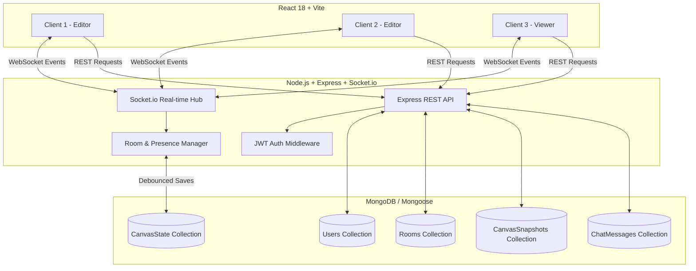
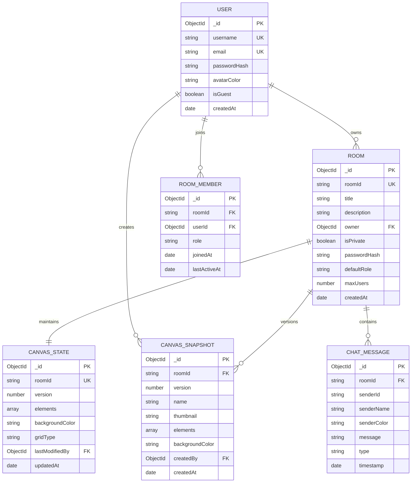

# Real-Time Collaborative Canvas Drawing Application (MERN Stack)

A high-performance, full-stack collaborative digital canvas and whiteboard web application built using the **MERN** (MongoDB, Express.js, React, Node.js) technology stack, powered by **Socket.io** WebSockets for sub-millisecond drawing synchronization, multiplayer cursor tracking, room-based permissions, version history snapshots, and live room chat.

---

## 🌟 Key Features

### 1. Real-Time Drawing Synchronization
- **Instant Stroke Streaming**: Freehand pencil, brush, and highlighter strokes stream incrementally as the user draws, providing immediate peer visual feedback.
- **Concurrent Non-Blocking Operations**: Multiple participants can draw, resize, move, and edit shapes simultaneously without blocking each other.
- **Operation Ordering & Conflict Resolution**: Action sequencing and last-write-wins timestamps ensure data integrity across all connected clients.

### 2. Multi-User Presence & Live Cursor Tracking
- **Multiplayer Floating Cursors**: Live cursor positions with collaborator avatar colors, usernames, and active tool indicators (pencil, highlighter, eraser, text, laser).
- **Remote Selection Indicators**: Highlights which shapes or elements other collaborators have currently selected to prevent editing conflicts.
- **Active Collaborator List**: Real-time presence indicator showing all online room members.

### 3. Advanced Drawing Toolkit
- **Freehand Tools**: Pencil, Smooth Brush, Semi-transparent Highlighter with Bézier curve interpolation.
- **Vector Geometric Shapes**: Rectangle, Rounded Rectangle, Circle/Ellipse, Triangle, 5-Point Star, Straight Line, Directed Arrow.
- **Rich Text & Sticky Notes**: On-canvas inline editable text boxes and pastel memo cards with drop shadows.
- **Laser Presentation Pointer**: Temporary fading glow trails for live presentations and meetings.
- **Infinite Viewport**: Smooth zoom (15% to 500%) with mouse wheel/pinch and Pan (Hand tool, Space+drag, Middle click).
- **Styling Controls**: Custom color palette, stroke width (1px - 24px), stroke styles (solid, dashed, dotted), fill styles, opacity slider, font sizing.
- **Grid & Alignment**: Dot grid, Line grid, and Snap-to-Grid options.

### 4. Canvas Session Persistence & Version Snapshots
- **Automatic DB Persistence**: Debounced MongoDB state saves ensure that drawing history is continuously persisted.
- **Session Recovery**: Users can disconnect and reconnect seamlessly, instantly resuming their canvas state.
- **Version History & Rollback**: Create named snapshots with auto-generated preview thumbnails and perform 1-click version rollbacks.

### 5. User Authentication & Room Permissions
- **Authentication**: JWT (JSON Web Tokens) with secure bcrypt password hashing + Instant Guest session access.
- **Room Management**: Create Public or Password-Protected rooms with custom titles, descriptions, and user limits.
- **Role-Based Access Control (RBAC)**:
  - 👑 **Owner**: Full administrative controls (manage permissions, update room settings, delete canvas, kick members).
  - ✏️ **Editor**: Can draw, add shapes, edit text, take snapshots, and clear canvas.
  - 👁️ **Viewer**: Read-only access with live synchronization (tools automatically locked).

### 6. Live Room Chat & Multi-Format Export
- **Room Chat**: Real-time in-canvas chat with timestamps, sender badges, system notifications, and typing indicators.
- **Export Options**: Download canvas as **PNG** (with transparent background option), **JPEG** (custom resolution 1x/2x/3x), **SVG** vector graphics file, and raw **JSON** backup.

---

## 🏗️ System Architecture



---

## 🔌 WebSocket Event Protocol Specification

| Event Name | Direction | Payload | Description |
| :--- | :--- | :--- | :--- |
| `join-room` | Client ➔ Server | `{ roomId }` | Client requests to join a room channel |
| `init-room-state` | Server ➔ Client | `{ roomId, role, elements, backgroundColor, activeUsers }` | Initial canvas state synchronization sent to joining client |
| `user-joined` | Server ➔ Broadcast | `{ user, activeUsers }` | Broadcasted when a new user enters the room |
| `user-left` | Server ➔ Broadcast | `{ socketId, userId, username, activeUsers }` | Broadcasted when a user disconnects or exits |
| `cursor-move` | Client ➔ Server | `{ x, y, tool, isDrawing }` | Client sends live cursor position |
| `remote-cursor-move` | Server ➔ Broadcast | `{ socketId, userId, username, avatarColor, x, y, tool, isDrawing }` | Broadcasted live cursor coordinates to peer clients |
| `draw-stroke-chunk` | Client ➔ Server | `{ id, type, strokeColor, strokeWidth, opacity, newPoints }` | Real-time streaming chunks during freehand drawing |
| `remote-stroke-chunk`| Server ➔ Broadcast | `{ id, type, strokeColor, strokeWidth, opacity, newPoints, userId }` | Immediate peer rendering of streaming strokes |
| `element-create` | Client ➔ Server | `{ element }` | Emitted when a shape or stroke is completed |
| `element-created` | Server ➔ Broadcast | `{ ...element, sequence, createdBy }` | Broadcasted to add finished element to peer canvases |
| `element-update` | Client ➔ Server | `{ elementId, updates }` | Emitted when an element is transformed/dragged/edited |
| `element-updated` | Server ➔ Broadcast | `{ elementId, updates, userId, sequence }` | Broadcasted to update element properties on peer canvases |
| `selection-change` | Client ➔ Server | `{ selectedElementIds }` | Emitted when selection changes |
| `remote-selection-change`| Server ➔ Broadcast| `{ socketId, username, avatarColor, selectedElementIds }` | Shows colored collaborator selection boxes |
| `element-delete` | Client ➔ Server | `{ elementIds }` | Emitted to delete selected element(s) |
| `element-deleted` | Server ➔ Broadcast | `{ elementIds, userId }` | Broadcasted to remove elements across all clients |
| `canvas-clear` | Client ➔ Server | - | Emitted to clear entire canvas |
| `canvas-cleared` | Server ➔ Broadcast | `{ clearedBy, userId }` | Clears canvas for all room participants |
| `sync-all-elements` | Client ➔ Server | `{ elements, backgroundColor }` | Full state sync after undo/redo/restore |
| `canvas-state-synced`| Server ➔ Broadcast | `{ elements, backgroundColor, syncedBy }` | Applies complete canvas state to all clients |
| `send-chat` | Client ➔ Server | `{ message }` | Sends live room chat message |
| `chat-message` | Server ➔ Broadcast | `{ roomId, senderId, senderName, senderColor, message, timestamp }` | Broadcasts new chat message to room |
| `typing-status` | Client ➔ Server | `{ isTyping }` | Emitted when typing in chat |
| `user-typing` | Server ➔ Broadcast | `{ userId, username, isTyping }` | Broadcasts typing status indicator |
| `update-user-role` | Client ➔ Server | `{ targetUserId, newRole }` | Room owner changes a member's role |
| `role-changed` | Server ➔ Client | `{ newRole }` | Direct event to updated user to switch tool permissions |

---

## 🗄️ Database Schema & Models



---

## 📡 REST API Documentation

### Base URL: `http://localhost:5000/api`

### 1. Authentication Endpoints

#### `POST /auth/register`
Create a new user account.
```json
// Request Body
{
  "username": "jane_designer",
  "email": "jane@example.com",
  "password": "securePassword123"
}

// Response (201 Created)
{
  "success": true,
  "message": "Account registered successfully.",
  "token": "eyJhbGciOiJIUzI1NiIsInR5cCI6...",
  "user": {
    "id": "60d0fe4f5311236168a109ca",
    "username": "jane_designer",
    "email": "jane@example.com",
    "avatarColor": "#6366f1",
    "isGuest": false
  }
}
```

#### `POST /auth/login`
Authenticate with email and password.
```json
// Request Body
{
  "email": "jane@example.com",
  "password": "securePassword123"
}
```

#### `POST /auth/guest`
Instant guest session generation for zero-friction evaluation.
```json
// Request Body
{
  "nickname": "Guest Illustrator"
}
```

#### `GET /auth/me`
Fetch current authenticated user profile (`Authorization: Bearer <token>`).

---

### 2. Room Endpoints

| Method | Endpoint | Auth | Description |
| :--- | :--- | :--- | :--- |
| `POST` | `/rooms` | Required | Create a new canvas room |
| `GET` | `/rooms/public` | None | List active public rooms |
| `GET` | `/rooms/my-rooms` | Required | Get rooms created & joined by current user |
| `GET` | `/rooms/:roomId` | Optional | Get room details, active count, and user's role |
| `POST` | `/rooms/:roomId/join`| Required | Join room (verifies password if private) |
| `PUT` | `/rooms/:roomId` | Required (Owner) | Update room metadata and privacy settings |
| `DELETE`| `/rooms/:roomId` | Required (Owner) | Delete room and all associated canvas history |
| `GET` | `/rooms/:roomId/members` | Optional | List members of a room |
| `PUT` | `/rooms/:roomId/members/:memberId` | Required (Owner) | Update member role (`editor` <-> `viewer`) |
| `DELETE`| `/rooms/:roomId/members/:memberId`| Required (Owner) | Remove/kick member from room |

---

### 3. Canvas State, Snapshots & Export Endpoints

| Method | Endpoint | Auth | Description |
| :--- | :--- | :--- | :--- |
| `GET` | `/canvas/:roomId/state` | Optional | Retrieve current canvas elements and version |
| `POST` | `/canvas/:roomId/state` | Required | Manually save canvas state |
| `POST` | `/canvas/:roomId/snapshots` | Required | Create a named version checkpoint |
| `GET` | `/canvas/:roomId/snapshots` | Optional | List all snapshots for the room |
| `POST` | `/canvas/:roomId/snapshots/:snapshotId/restore` | Required | Restore canvas to a snapshot version |
| `GET` | `/canvas/:roomId/export` | Optional | Download complete canvas state as JSON |
| `GET` | `/canvas/:roomId/chat` | Optional | Retrieve recent room chat message history |

---

## 🚀 Setup & Execution Guide

### Prerequisites
- **Node.js**: v16+ (tested on Node v20/v24)
- **npm**: v8+
- *(Optional)* Local MongoDB instance or MongoDB Atlas connection string. If no MongoDB is running, the application **automatically spins up an embedded in-memory MongoDB server** with zero configuration!

---

### Quick Start (Automated Execution)

1. **Clone or open repository**:
```bash
cd collab-canvas
```

2. **Start Backend Server**:
```bash
cd backend
npm install
npm start
```
*Backend runs on `http://localhost:5000` with WebSockets on `ws://localhost:5000`.*

3. **Start Frontend Client**:
Open a second terminal window:
```bash
cd frontend
npm install
npm run dev
```
*Frontend will launch on `http://localhost:5173`.*

4. **Open Application**:
Open your browser and navigate to **`http://localhost:5173`**.

---

## 🧪 Testing Multi-User Collaboration

To test real-time collaboration on your machine:
1. Open `http://localhost:5173` in **Window A** (e.g. Standard Chrome).
2. Click **Create Room** or **Quick Guest Canvas**.
3. Copy the URL from the browser bar or click **"Invite / Share"** in the top header.
4. Open the link in **Window B** (Incognito Window or another browser like Firefox/Edge).
5. Move your mouse in Window A and watch the live cursor with colored name tag and active tool icon appear instantaneously in Window B.
6. Draw with the pencil or add shapes in Window A and watch them sync live in real-time in Window B.
7. Open the **Room Chat** on the right side and exchange real-time messages!
8. Click **Snapshots** to create a named version, draw more shapes, and click **Restore** to roll back history.

---

## 📁 Repository Directory Structure

```
├── backend/
│   ├── src/
│   │   ├── config/
│   │   │   └── db.js                 # MongoDB connection & Embedded fallback
│   │   ├── controllers/
│   │   │   ├── authController.js     # User registration, login, guest auth
│   │   │   ├── roomController.js     # Room CRUD & role administration
│   │   │   └── canvasController.js   # Canvas state, snapshots & export
│   │   ├── middleware/
│   │   │   └── auth.js               # JWT auth & room role check
│   │   ├── models/
│   │   │   ├── User.js               # User model (bcrypt)
│   │   │   ├── Room.js               # Room model
│   │   │   ├── RoomMember.js         # Room membership & permissions
│   │   │   ├── CanvasState.js        # Active canvas elements array
│   │   │   ├── CanvasSnapshot.js     # Version history checkpoints
│   │   │   └── ChatMessage.js        # Collaborative room chat logs
│   │   ├── routes/
│   │   │   ├── authRoutes.js         # Auth routes
│   │   │   ├── roomRoutes.js         # Room routes
│   │   │   └── canvasRoutes.js       # Canvas routes
│   │   ├── sockets/
│   │   │   └── socketHandler.js      # Real-time WebSocket sync engine
│   │   └── server.js                 # HTTP + Express + Socket.io entry
│   ├── .env                          # Environment variables
│   └── package.json                  # Backend dependencies & scripts
│
├── frontend/
│   ├── src/
│   │   ├── components/
│   │   │   ├── Navbar.jsx            # Top navbar
│   │   │   ├── CanvasHeader.jsx      # Room header, user stack & share
│   │   │   ├── CanvasToolbar.jsx     # Floating tools & styling controls
│   │   │   ├── CanvasBottomBar.jsx   # Zoom, undo/redo, grid, clear
│   │   │   ├── RemoteCursors.jsx     # Multiplayer cursor layer
│   │   │   ├── ChatSidebar.jsx       # Live room chat panel
│   │   │   ├── CollaboratorsSidebar.jsx # Member list & role controls
│   │   │   ├── SnapshotModal.jsx     # Version history & rollback dialog
│   │   │   ├── ExportModal.jsx       # PNG, JPEG, SVG, JSON export
│   │   │   └── CreateRoomModal.jsx   # Room creation modal
│   │   ├── context/
│   │   │   ├── AuthContext.jsx       # Auth state provider
│   │   │   └── SocketContext.jsx     # WebSocket provider & emitters
│   │   ├── hooks/
│   │   │   └── useCanvas.js          # Canvas state, tools & viewport hook
│   │   ├── pages/
│   │   │   ├── LobbyPage.jsx         # Room dashboard & lobby
│   │   │   ├── CanvasPage.jsx        # Fullscreen collaborative canvas
│   │   │   ├── LoginPage.jsx         # Sign in page
│   │   │   └── RegisterPage.jsx      # Sign up page
│   │   ├── utils/
│   │   │   ├── canvasRenderer.js     # HTML5 canvas geometry & renderer
│   │   │   └── canvasExport.js       # PNG, SVG, JSON export utilities
│   │   ├── App.jsx                   # React Router entry
│   │   ├── main.jsx                  # React DOM mount
│   │   └── index.css                 # Glassmorphic CSS design system
│   ├── index.html                    # HTML5 index template
│   ├── vite.config.js                # Vite config & API/WS proxy
│   └── package.json                  # Frontend dependencies
│
├── postman_collection.json           # Ready-to-import Postman API collection
├── package.json                      # Root workspace scripts
└── README.md                         # Project documentation
```

---

## ⚡ Concurrency & Optimization Architecture

1. **Streaming Stroke Chunks**: Instead of waiting for `pointerup` to transmit a finished drawing, incremental coordinate batches are sent as `draw-stroke-chunk` packets during active drawing, giving real-time live stroke previews to peers with zero perceptible lag.
2. **Normalized World Coordinates**: All drawing shapes, text, and strokes are calculated and stored in world space coordinates. When different users on different devices (laptop, 4K monitor, mobile) zoom or pan independently, strokes render in pixel-perfect alignment.
3. **Debounced Database Storage**: High-frequency real-time drawing operations are coordinated in-memory with a 1-second debounce buffer before flushing to MongoDB, achieving 60 FPS collaborative performance while minimizing database I/O.
4. **Optimistic Client Updates**: Client immediately renders local strokes and transforms, with background server acknowledgment and sequence numbering for conflict resolution.

---

## 🔒 Security Practices
- Passwords hashed using **bcrypt** with salt factor 10.
- Stateless authentication with **JWT** tokens and expiration.
- WebSocket handshakes authenticated with JWT verification.
- Role-based route & socket event authorization preventing viewers from executing canvas writes or deletions.
- Sanitized payloads to protect against cross-site scripting and unauthorized state injection.

---

## 📄 License
MIT License. Created for Real-Time Collaborative Canvas Drawing Application.
